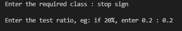

# Download custom image class and its annotations for Tensorflow Object Detection.

Download specific image class as well as its annotation from the COCO dataset for Tensorflow Object Detection.

[Visit this article for additional help on installation](https://baizel.medium.com/how-to-download-images-and-annotations-of-a-single-object-class-from-coco-dataset-6d0ae8ee8c42)

## Steps:

1. Clone the repository

2. Download JSON file from COCO website

   - For 2017 version,
    ```
    wget http://images.cocodataset.org/annotations/annotations_trainval2017.zip or open the link and save the zip file
    ```
   - For 2014 version,
    ```
    wget http://images.cocodataset.org/annotations/annotations_trainval2014.zip or open the link and save the zip file
    ```
    
   - Unzip the file

3. Enter the path for root directory and annotation file in required_classes.py file

4. Run the following command
   ```
    python run.py
    ```

5. Enter the required class as well as the test ratio in the terminal<br><br>
   

6. Images will be downloaded and saved in a folder with foldername as classname. Also, images will be splitted into train and test based on given test ratio. Annotations will be saved in a csv file. Also, train and test annotations, will be saved as seperate csv's in train and test folders.

## Cool, your image class is ready for Tensorflow Object Detection

## Available Classes in COCO dataset

        python coco_available_classes.py -y <year> to see it. eg : python coco_available_classes.py -y 2017
   
# Reference

    https://github.com/cocodataset/cocoapi/issues/271
